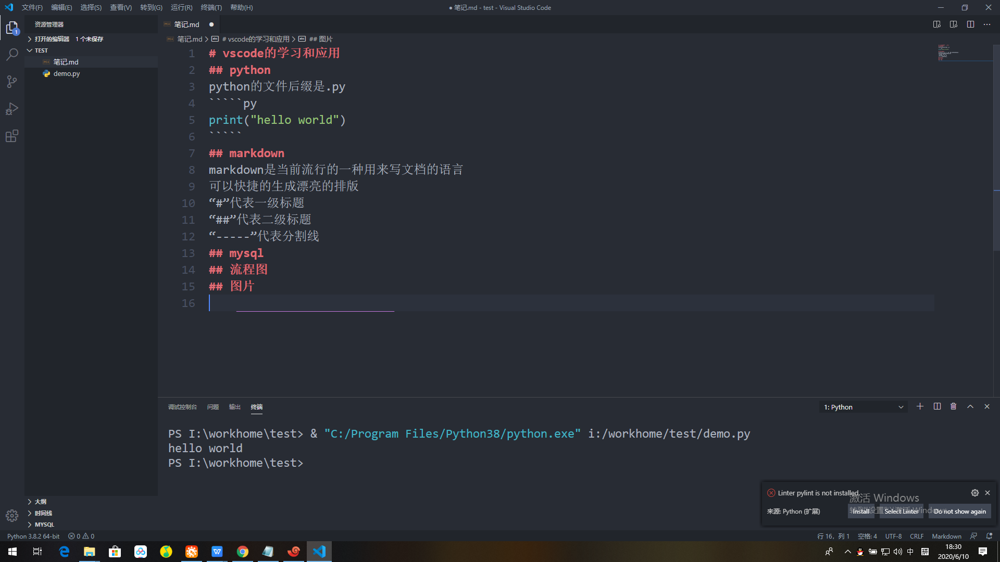

# vscode的学习和应用
## python
python的文件后缀是.py
`````py
print("hello world")
`````
## markdown
markdown是当前流行的一种用来写文档的语言
可以快捷的生成漂亮的排版
“#”代表一级标题
“##”代表二级标题
“-----”代表分割线
## mysql

## 流程图
流程图的文件后缀名是.dio
## 图片


## git的配置
注册GitHub
安装git
vscode的设置里弄好git的路径
在git base里做好设置
同步GitHub

